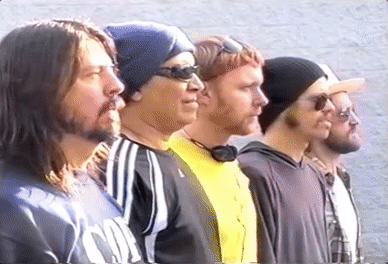

# Projet Main Eventer

Ce projet a pour objectifs de: 
- vous permettre d'apprendre sur base de demandes réalistes.  :
- vous apprendre le html css en integrant un onpage sur base d'une maquette.
- Apprendre à travailler en équipe:
  - utilisation de git en groupe"passer le relai" et inversément.
- Vivre les étapes de conception d'un projet one page.
- Vous apprendre à gérer un projets avec différentes méthodologie.

## Détails du projet 

 Vous êtes une toute nouvelle société de développement web et vous avez décroché votre premier client.

 - Vous serez repartis en équipes de 4 à 5 pour la durée du projet.
 - Vous aurez jusqu'au mardi 30 octobre pour terminer le projet.
 - Il vous faudra vous renseigner sur le positionnement CSS:
    - Display (block, inline-block, flex...)
    - Les balises (form, section, span) devront obligatoirement être utilisées, aux bons endroits.
    - Vous devrez aussi utiliser plusieurs propriétés background en css.
 - Le 29 vous aurez une réunion client (coachs) pour parler de l'avancement du projet en détails.   

## Spécification

- Dans chaque équipe, vous designerez une personne chargée de la communication entre le client (nous, vos coaches) et votre équipe.
- Nous aurons besoins d'un rapport quotidien, par mail, de l'avancement de votre travail.
- Chaque membre de l'équipe aura une section du site à intégrer.
- Le projet devra être accessible en ligne _via_ une **github page**.
- Gérer vos repos comme vous le souhaitez (branch, commit, merge, pull, request) 

## _Brief_ du client:

> Bonjour, j'ai actuellement besoin de vos services pour la création d'un _onepage_ pour notre agence d'évenementiel. Dans le but de vous aider le plus possible, nous vous fournissons:
    - les imagess
    - la maquette
    - les polices à utiliser

* * *

> **N'oubliez pas :** le travail d'équipe est primordial !!!!!!!! :p

